# Wheelie

TCP-based client-server binary protocol for unstable data transmission medium. Version 1.1.

# Motivation

A large number of cases in different projects require an interaction protocol between clients running over mobile networks and a server. This imposes the following requirements:
* The fastest possible disconnect detection
* The fastest possible reconnect
* The ability to transfer large files with the restoration of the transfer from the same place where it left off after reconnect
* Traffic prioritization: commands should be sent with a higher priority than files.

# Concepts

To implement a protocol that fulfills the requirements, the following concepts are proposed:
* Client-server protocol over TCP
* The server can send events to the client
* All interaction between the client and the server through one tcp connection
* Versatility within supported operations
* Orientation to an unstable network environment: the fastest detection of disconnects through its own pings and a pool of connections for reconnect
* Serialization with protobuf
* Separation into low-level and high-level packages
* Built-in authorization support
* Prioritization of frames with commands over frames with files.

# High Level protocol Operations

The protocol provides the following high-level operations:
* **Connect** - establishing a connection between client and server
* **Setup** - setting up a connection, determining its capabilities
* **Auth** - authorization/authentication
* **Ping** - сonnection health check
* **Get** - simple request-response
* **CriticalGet** - request-response of critical importance
* **MultiGet** - request for large data transmitted in parts
* **MultiPush** - sending a large amount of data transmitted in parts
* **ServerPush** - sending simple data from the server to the client
* **CriticalServerPush** - sending critical data from the server to the client
* **FireAndForget** - sending simple data without acknowledging receipt
* **Close** - close connection from client side 
* **Disconnect** - close connection from server side 

# Protocol terms

Information is exchanged in both directions using low-level data packets with a conditional maximum length limit - frames (**Frame**). Inside the frames in binary form (serialized using protobuf) contains data - a packet with information (**Packet**). One or more packets may send all or part of a high-level message (**Message**). **Message** depends on business logic of Application which uses Qoollo.Wheelie and is outside the scope of current protocol.

# Global connection pipeline

Global connection pipeline between client and server can be formalized as FSM:

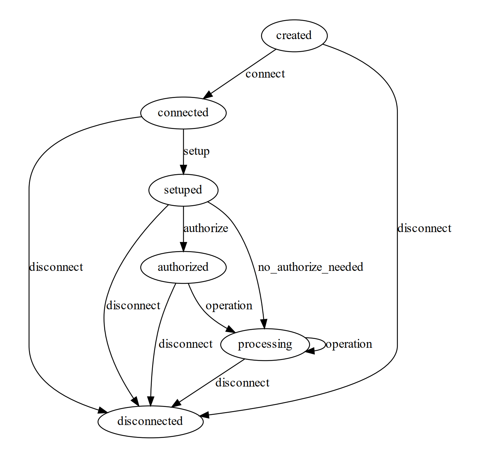

# Frames

**Frame** presented in [TLV](https://en.wikipedia.org/wiki/Type%E2%80%93length%E2%80%93value) (Tag-Length-Value) format.

| Field name | Type   | Length            | Bytes order   | Description                      |
|------------|--------|-------------------|---------------|----------------------------------|
| Tag        | int    | 4 bytes           | Big-endian    | Packet type                      |
| Length     | int    | 4 bytes           | Big-endian    | Length of Value in bytes         |
| Value      | byte[] | Depends on Length | Little-endian | Packet in binary protobuf format |

Table of packet tags in frames:

| Tag | Packet                      |
|-----|-----------------------------|
| 0   | FireAndForgetPacket         |
| 1   | ConnectPacket               |
| 2   | ConnectResponsePacket       |
| 3   | SetupPacket                 |
| 4   | SetupResponsePacket         |
| 5   | AuthPacket                  |
| 6   | AuthResponsePacket          |
| 7   | PingPacket                  |
| 8   | PingResponsePacket          |
| 9   | ClosePacket                 |
| 10  | DisconnectPacket            |
| 11  | GetPacket                   |
| 12  | GetResponsePacket           |
| 13  | CriticalGetPacket           |
| 14  | CriticalGetResponsePacket   |
| 15  | ServerPushPacket            |
| 16  | ServerPushAckPacket         |
| 17  | CriticalServerPushPacket    |
| 18  | CriticalServerPushAckPacket |
| 19  | MultiPartPacket             |
| 20  | MultiPartAckPacket          |
| 21  | MultiGetPacket              |
| 22  | MultiGetResponsePacket      |
| 23  | MultiPushPacket             |
| 24  | MultiPushResponsePacket     |

# Packets

All packets are serialized in [Protobuf](https://developers.google.com/protocol-buffers) and their specification is described in .proto file in this repo: [specs/proto/WheeliePackets.proto](./specs/proto/WheeliePackets.proto). Models in that file can be compiled to any language classes by protobuf compiler which can be downloaded from Releases in it's official [github repo](https://github.com/protocolbuffers/protobuf).

# Packet prioroties

There are three main priorities of packets: max, medium and low. The priority is strictly tied to the packet type. The priority type determines the order in which packets should be processed. Packets with a lower priority should only be processed when there are no incoming packets with a higher priority. Table of priorities:

| Max                         | Medium                     | Low                |
|-----------------------------|----------------------------|--------------------|
| ClosePacket                 | FireAndForgetPacket        | MultiPartPacket    |
| DisconnectPacket            | ConnectPacket              | MultiPartAckPacket |
| CriticalGetPacket           | ConnectResponsePacket      |                    |
| CriticalGetResponsePacket   | SetupPacket                |                    |
| CriticalServerPushPacket    | SetupResponsePacket        |                    |
| CriticalServerPushAckPacket | SetupResponsePacketPayload |                    |
|                             | AuthPacket                 |                    |
|                             | AuthResponsePacket         |                    |
|                             | GetPacket                  |                    |
|                             | GetResponsePacket          |                    |
|                             | ServerPushPacket           |                    |
|                             | ServerPushAckPacket        |                    |
|                             | MultiGetPacket             |                    |
|                             | MultiGetResponsePacket     |                    |
|                             | MultiPushPacket            |                    |
|                             | MultiPushResponsePacket    |                    |
|                             | PingPacket                 |                    |
|                             | PingResponsePacket         |                    |                       

# Operations description

## Connect

Used to establish a connection between a server and a client. During it, the client and server exchange their identifiers. In addition,  server sends the result code (*StatusCode*) of the operation and its description (*Description*), which is optional and depends on the implementation. Response code table: 

| Status code   | Description                                                      |
|---------------|------------------------------------------------------------------|
| 0             | Connection success                                               |
| 1             | Connection refused due to server's errors                        |
| 2             | Connection refused due to too many connections from this client  |

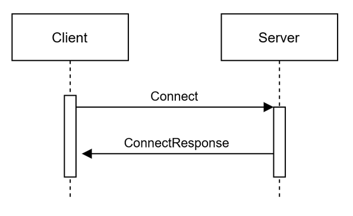

## Setup

Used to exchange versions of client and server implementations, and to set up a connection. The body of *SetupResponsePayload* can be expanded in the future without making major changes to the protocol. For now, *SetupResponsePayload* signals about need of making **Auth** for client. The field *CanResume* in *SetupResponsePacket* signals the possibility to continue interaction with the current versions of the client and server protocols. If it is false, server must **Disconnect** afterwards. Payload of **SetupPacket** reserved for future usage and is empty for current version of Protocol. 

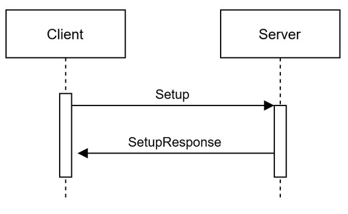

## Auth

Used to authenticate/authorize client. Payload of **AuthPacket** and **AuthResponsePacket** depends on business logic of Application and must be transmitted by this protocol "as is". In addition, server sends the result code (*StatusCode*) of the operation and its description (*Description*), which is optional and depends on the implementation. Response code table: 

| Status code   | Description                                            |
|---------------|--------------------------------------------------------|
| 0             | Auth success or it isn't needed                        |
| 1             | Auth error: invalid credentials                        |
| 2             | Auth error: server couldn't parse client's credentials |
| 3             | Auth error: error on server side                       |

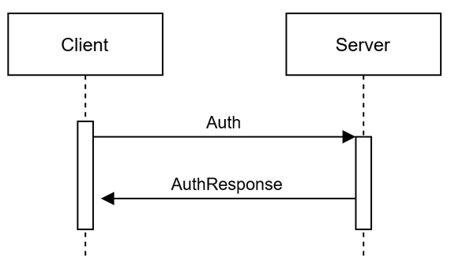

## Ping

Used to check connection health. **PingPacket** must be sended every 10 secs from client to server right after first connection attempt. If not, server must **Disconnect**. If server doesn't respond to client with **PingResponsePacket** in 10 secs, client must **Close** connection.

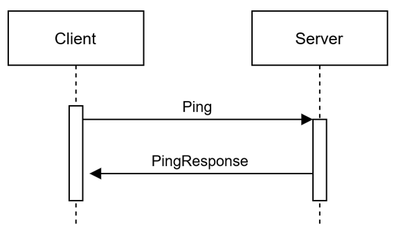

## Close

Used to close connection by client. **ClosePacket** contains *StatusCode* of diconnection reason and it's optional *Description*. Code table:

| Status code   | Description                                        |
|---------------|----------------------------------------------------|
| 0             | Client application shutdown                        |
| 1             | Client internal error                              |
| 2             | Logout                                             |
| 3             | No PingResponsePacket received in specified time   |
| 4             | Server protocol version is not supported by client |
| 5             | Server packet parsing problem                      |
| 6             | Something else                                     |

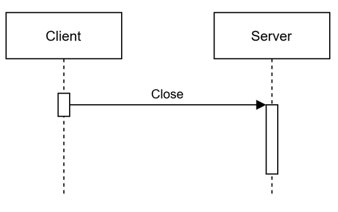

## Disconnect

Used to close connection by server. **DisconnectPacket** contains *StatusCode* of diconnection reason and it's optional *Description*. Code table:

| Status code   | Description                                        |
|---------------|----------------------------------------------------|
| 0             | Server application shutdown                        |
| 1             | Server internal error                              |
| 2             | No PingPacket received in specified time           |
| 3             | Client protocol version is not supported by server |
| 4             | Client packet parsing problem                      |
| 5             | Connection setup was failed                        |
| 6             | Client auth was failed                             |
| 7             | Something else                                     |

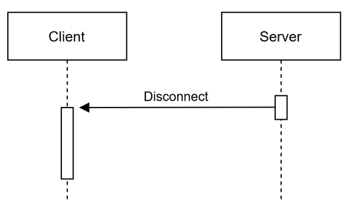

## Get

Used to do simple request from client to server and get simple response.

| Status code | Description                   |
|-------------|-------------------------------|
| 0           | Success                       |
| 1           | Client packet parsing problem |
| 2           | Client problem                |
| 3           | Internal server problem       |

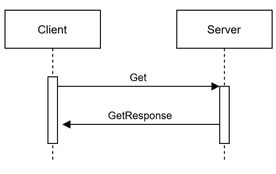

## CriticalGet

Used to do simple request from client to server and get simple response with maximum priority. For critical data and signals.

| Status code | Description                   |
|-------------|-------------------------------|
| 0           | Success                       |
| 1           | Client packet parsing problem |
| 2           | Client problem                |
| 3           | Internal server problem       |

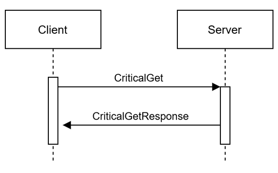

## ServerPush

Used to send notifications from server to client. It's strictly recomended not to use it for sending big data packages. Instead, it is better to use this method to send a resource identifier to the client, which it will already download on its own in the best way for it.

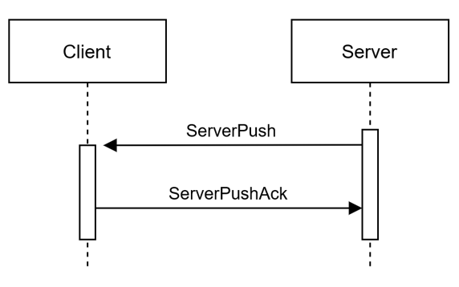

## CriticalServerPush

Used to send critical notifications from server to client with maximum priority of processing.

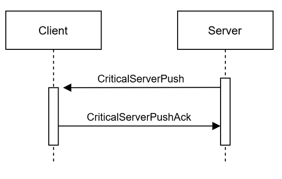

## MultiGet

Used to receive large data from the server. The data is sent in small chunks so that the transmission can be restored after a reconnect from the part where the transmission was interrupted and the connection was closed. The parts are sent in the exact correct order.

| Status code | Description                   |
|-------------|-------------------------------|
| 0           | Success                       |
| 1           | Client packet parsing problem |
| 2           | Start part out of range       |
| 3           | Client problem                |
| 4           | Internal server problem       |

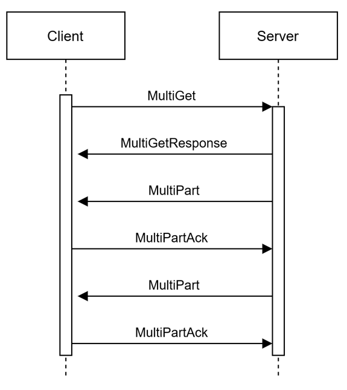

## MultiPush

Used to send large data from client to server. The data is sent in small chunks so that the transmission can be restored after a reconnect from the part where the transmission was interrupted and the connection was closed. The parts are sent in the exact correct order.

| Status code | Description                   |
|-------------|-------------------------------|
| 0           | Success                       |
| 1           | Client packet parsing problem |
| 2           | Start part out of range       |
| 3           | Client problem                |
| 4           | Internal server problem       |

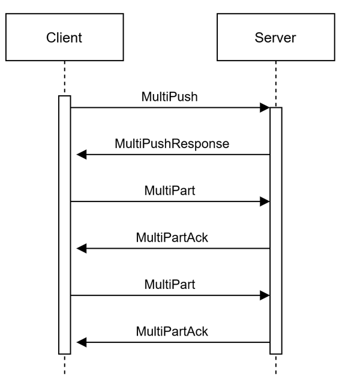

## FireAndForget

Used to transfer small amounts of data and notifications in any direction without delivery confirmation at the level of this protocol.

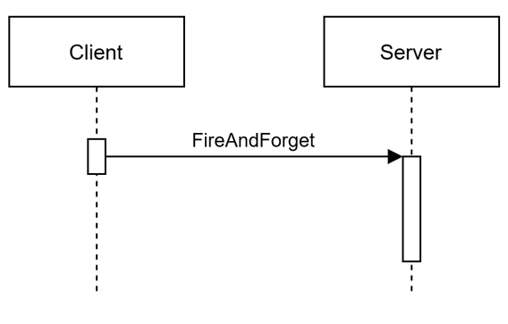
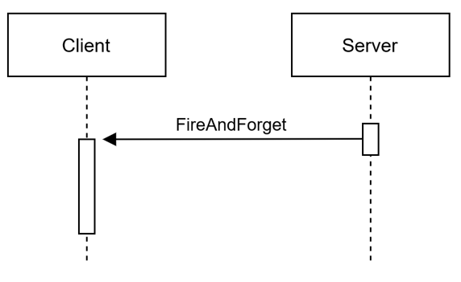